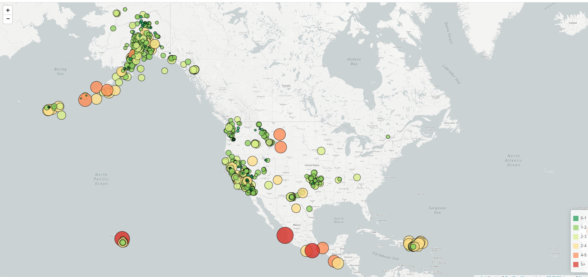
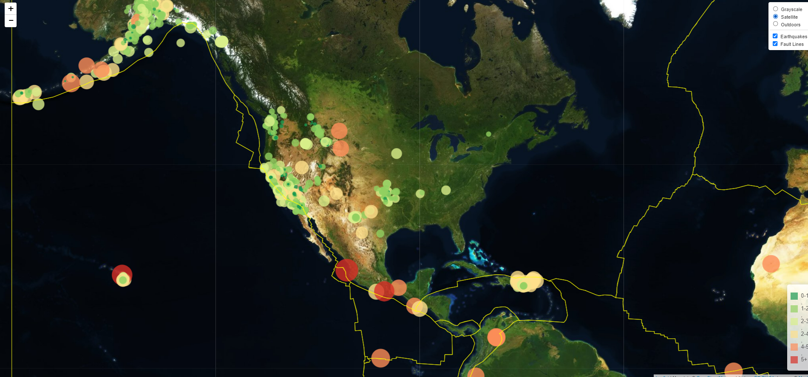

# leaflet-challenge

## Introduction

This is my submission for for leaflet homework

## Structure
```
|_Leaflet-Step-1
	|_static
		|_css
			|_style.css
		|_js
			|_config.js
			|_logic.js
	|_index.html
|_Leaflet-Step-2
	|_static
		|_css
			|_style.css
		|_data
			|_PB2002_plates.json
		|_js
			|_config.js
			|_logic.js
	|_index.html
|_.gitignore
|_README.md
|_Leaflet1.png
|_Leaflet2.png


```

## Usage
```
HTML5
CSS W3
Bootstrap 4.3.1
JavaScript ES6
D3.js
Leaflet
Mapbox

```

## Summary

When the basic version of the map is deployed the world map is rendered in grayscale. D3 is used to call and chart the past 7 days of earthquake data obtained from 
the [USGS GeoJSON Feed](http://earthquake.usgs.gov/earthquakes/feed/v1.0/geojson.php) page. The data points are placed onto the corresponding geocoordinates as circle 
markers where the size and colour corresponds to the maganitude. Note: due to the use of the Web Mercator World projection in the map rendering the size is only a 
rough indication and should not be used to compare datasets across larger distances.




When the more complex map is deployed the world map is rendered as a satellite image with 2 additional base layers. The original earthquake data points are rendered and the 
fault lines are mapped using the tetonic plate data from [https://github.com/fraxen/tectonicplates](https://github.com/fraxen/tectonicplates). Both datasets can be toggled 
on and off.




